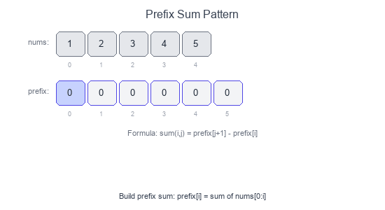

# Introduction to Prefix Sum Pattern

The **Prefix Sum** pattern precomputes cumulative sums to answer range sum queries in O(1) time. Instead of summing elements repeatedly, you build a prefix array once and use subtraction to find any subarray sum.

## Visual Example

### Building and Using Prefix Sum


`prefix[i]` = sum of elements from index 0 to i-1.
Sum of `nums[i:j]` = `prefix[j] - prefix[i]`.

## Key Formula

```
prefix[0] = 0
prefix[i] = prefix[i-1] + nums[i-1]

sum(nums[i:j]) = prefix[j] - prefix[i]
```

## When to Use

- Multiple range sum queries on static array.
- Find subarray with target sum.
- Count subarrays with specific sum property.
- 2D matrix sum queries.
- Problems involving "sum equals K" or "sum divisible by K".

## Pattern Recipe

1. **Build prefix array**: `prefix[i] = prefix[i-1] + nums[i-1]`.
2. **Query**: `sum(i, j) = prefix[j+1] - prefix[i]`.
3. **For counting problems**: Use hashmap to store prefix sum frequencies.

## Complexity

- Build: $O(n)$
- Query: $O(1)$
- Space: $O(n)$ for prefix array

## Short Examples — Python

### Basic Prefix Sum

```python
def build_prefix(nums: list[int]) -> list[int]:
    prefix = [0] * (len(nums) + 1)
    for i in range(len(nums)):
        prefix[i + 1] = prefix[i] + nums[i]
    return prefix

def range_sum(prefix: list[int], i: int, j: int) -> int:
    """Sum of nums[i:j+1] (inclusive)."""
    return prefix[j + 1] - prefix[i]

# Example:
# nums = [1, 2, 3, 4, 5]
# prefix = [0, 1, 3, 6, 10, 15]
# sum(1, 3) = prefix[4] - prefix[1] = 10 - 1 = 9  (2+3+4)
```

### Subarray Sum Equals K

```python
def subarray_sum(nums: list[int], k: int) -> int:
    """Count subarrays with sum equal to k."""
    count = 0
    prefix_sum = 0
    prefix_count = {0: 1}  # Empty prefix has sum 0

    for num in nums:
        prefix_sum += num

        # If (prefix_sum - k) exists, we found subarrays
        if prefix_sum - k in prefix_count:
            count += prefix_count[prefix_sum - k]

        prefix_count[prefix_sum] = prefix_count.get(prefix_sum, 0) + 1

    return count

# Example: [1, 1, 1], k=2 → 2 subarrays: [1,1] at index 0-1 and 1-2
```

### Subarray Sum Divisible by K

```python
def subarrays_div_by_k(nums: list[int], k: int) -> int:
    """Count subarrays with sum divisible by k."""
    count = 0
    prefix_sum = 0
    remainder_count = {0: 1}

    for num in nums:
        prefix_sum += num
        remainder = prefix_sum % k

        # Handle negative remainders
        if remainder < 0:
            remainder += k

        if remainder in remainder_count:
            count += remainder_count[remainder]

        remainder_count[remainder] = remainder_count.get(remainder, 0) + 1

    return count

# Example: [4, 5, 0, -2, -3, 1], k=5 → 7
```

### Find Pivot Index (Left sum equals right sum)

```python
def pivot_index(nums: list[int]) -> int:
    total = sum(nums)
    left_sum = 0

    for i, num in enumerate(nums):
        # Right sum = total - left_sum - nums[i]
        if left_sum == total - left_sum - num:
            return i
        left_sum += num

    return -1

# Example: [1, 7, 3, 6, 5, 6] → 3 (left: 1+7+3=11, right: 5+6=11)
```

### Product of Array Except Self

```python
def product_except_self(nums: list[int]) -> list[int]:
    n = len(nums)
    result = [1] * n

    # Left products
    left_product = 1
    for i in range(n):
        result[i] = left_product
        left_product *= nums[i]

    # Right products
    right_product = 1
    for i in range(n - 1, -1, -1):
        result[i] *= right_product
        right_product *= nums[i]

    return result

# Example: [1, 2, 3, 4] → [24, 12, 8, 6]
```

### 2D Prefix Sum (Range Sum Query)

```python
class NumMatrix:
    def __init__(self, matrix: list[list[int]]):
        if not matrix:
            return

        rows, cols = len(matrix), len(matrix[0])
        self.prefix = [[0] * (cols + 1) for _ in range(rows + 1)]

        for r in range(rows):
            for c in range(cols):
                self.prefix[r+1][c+1] = (
                    matrix[r][c]
                    + self.prefix[r][c+1]
                    + self.prefix[r+1][c]
                    - self.prefix[r][c]
                )

    def sum_region(self, r1: int, c1: int, r2: int, c2: int) -> int:
        return (
            self.prefix[r2+1][c2+1]
            - self.prefix[r1][c2+1]
            - self.prefix[r2+1][c1]
            + self.prefix[r1][c1]
        )

# Visualize 2D prefix:
#   □ □ □      Query (r1,c1) to (r2,c2):
#   □ ■ ■      = prefix[r2+1][c2+1]
#   □ ■ ■        - prefix[r1][c2+1]    (top)
#                - prefix[r2+1][c1]    (left)
#                + prefix[r1][c1]      (overlap)
```

### Maximum Subarray Sum (Kadane's via prefix)

```python
def max_subarray_prefix(nums: list[int]) -> int:
    """
    max(prefix[j] - prefix[i]) where j > i
    = prefix[j] - min(prefix[0..j-1])
    """
    max_sum = float('-inf')
    prefix_sum = 0
    min_prefix = 0

    for num in nums:
        prefix_sum += num
        max_sum = max(max_sum, prefix_sum - min_prefix)
        min_prefix = min(min_prefix, prefix_sum)

    return max_sum
```

### Continuous Subarray Sum (Multiple of K)

```python
def check_subarray_sum(nums: list[int], k: int) -> bool:
    """Check if subarray of length >= 2 has sum multiple of k."""
    remainder_index = {0: -1}
    prefix_sum = 0

    for i, num in enumerate(nums):
        prefix_sum += num
        remainder = prefix_sum % k if k != 0 else prefix_sum

        if remainder in remainder_index:
            if i - remainder_index[remainder] >= 2:
                return True
        else:
            remainder_index[remainder] = i

    return False
```

### Binary Subarrays With Sum

```python
def num_subarrays_with_sum(nums: list[int], goal: int) -> int:
    """Count subarrays with sum equal to goal (binary array)."""
    count = 0
    prefix_sum = 0
    prefix_count = {0: 1}

    for num in nums:
        prefix_sum += num

        if prefix_sum - goal in prefix_count:
            count += prefix_count[prefix_sum - goal]

        prefix_count[prefix_sum] = prefix_count.get(prefix_sum, 0) + 1

    return count
```

## Common Patterns

| Problem | Technique |
|---------|-----------|
| Range sum | `prefix[j] - prefix[i]` |
| Sum equals K | HashMap of prefix sums |
| Sum divisible by K | HashMap of remainders |
| Pivot index | Compare left and right sums |
| 2D range sum | 2D prefix with inclusion-exclusion |

## Common Pitfalls

- Off-by-one errors with prefix indices.
- Forgetting to handle empty prefix (prefix_count[0] = 1).
- Negative remainder in "divisible by K" problems.
- Not handling k=0 case separately.

## Problems to Practice

- [Range Sum Query - Immutable](https://leetcode.com/problems/range-sum-query-immutable/)
- [Range Sum Query 2D - Immutable](https://leetcode.com/problems/range-sum-query-2d-immutable/)
- [Subarray Sum Equals K](https://leetcode.com/problems/subarray-sum-equals-k/)
- [Subarray Sums Divisible by K](https://leetcode.com/problems/subarray-sums-divisible-by-k/)
- [Find Pivot Index](https://leetcode.com/problems/find-pivot-index/)
- [Product of Array Except Self](https://leetcode.com/problems/product-of-array-except-self/)
- [Continuous Subarray Sum](https://leetcode.com/problems/continuous-subarray-sum/)
- [Binary Subarrays With Sum](https://leetcode.com/problems/binary-subarrays-with-sum/)
