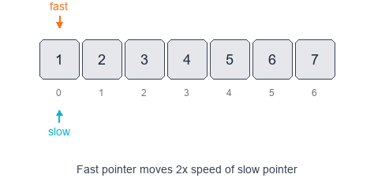

# Fast & Slow Pointers Pattern

The Fast & Slow (aka Tortoise and Hare) pattern uses two pointers that move through a data structure at different speeds. It's especially powerful on linked lists and sequences where relative distance or cycle detection is required.

## Visual Example

### Finding Middle Element


When to use
- You need to detect cycles or loops (e.g., linked list cycle detection).
- You need the middle element, or to compare elements separated by a fixed gap (e.g., remove Nth from end).
- You want to measure distances (cycle length, starting point of a cycle).

Common variants
- Floyd's cycle-finding (tortoise & hare): move slow by 1 and fast by 2.
- Gap-based two-pointer: advance fast by `k` then move both until fast reaches the end.
- Fast/slow for finding middle: advance fast by 2 and slow by 1; when fast finishes, slow is at middle.

Pattern recipe
1. Initialize `slow = head`, `fast = head` (or indices for arrays).
2. Move `slow` one step and `fast` two steps (or move according to the variant needed).
3. Check conditions: collision => cycle; `fast` reaches end => no cycle; when `fast` finishes => `slow` at middle.
4. For cycle start: after meeting, reset one pointer to head and move both at speed 1 until they meet again.

Complexity
- Time: O(n) — single pass or constant-number passes.
- Space: O(1) extra space.

Examples

1) Detect cycle (Floyd's algorithm) — Python

```python
class ListNode:
    def __init__(self, val=0, next=None):
        self.val = val
        self.next = next

def has_cycle(head):
    slow = fast = head
    while fast and fast.next:
        slow = slow.next
        fast = fast.next.next
        if slow is fast:
            return True
    return False
```

To find the cycle start:

```python
def detect_cycle_start(head):
    slow = fast = head
    while fast and fast.next:
        slow = slow.next
        fast = fast.next.next
        if slow is fast:
            break
    else:
        return None
    ptr = head
    while ptr is not slow:
        ptr = ptr.next
        slow = slow.next
    return ptr
```

2) Middle of linked list — Python

```python
def middle_node(head):
    slow = fast = head
    while fast and fast.next:
        slow = slow.next
        fast = fast.next.next
    return slow
```

3) Remove Nth node from end — gap technique (Python)

```python
def remove_nth_from_end(head, n):
    dummy = ListNode(0, head)
    fast = slow = dummy
    for _ in range(n):
        fast = fast.next
    while fast.next:
        fast = fast.next
        slow = slow.next
    slow.next = slow.next.next
    return dummy.next
```

4) JavaScript: detect cycle (Floyd)

```javascript
function hasCycle(head) {
  let slow = head, fast = head;
  while (fast && fast.next) {
    slow = slow.next;
    fast = fast.next.next;
    if (slow === fast) return true;
  }
  return false;
}
```

Practice problems
- [Linked List Cycle](https://leetcode.com/problems/linked-list-cycle/) (detect)
- [Linked List Cycle II](https://leetcode.com/problems/linked-list-cycle-ii/) (find cycle start)
- [Middle of the Linked List](https://leetcode.com/problems/middle-of-the-linked-list/)
- [Remove Nth Node From End of List](https://leetcode.com/problems/remove-nth-node-from-end-of-list/)
- [Happy Number](https://leetcode.com/problems/happy-number/) (number-cycle detection using fast/slow on digits)
