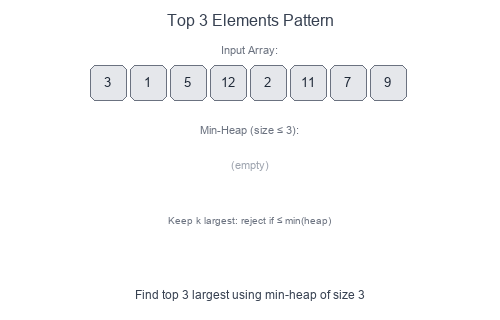

# Introduction to Top 'K' Elements Pattern

The **Top 'K' Elements** pattern uses a heap (priority queue) to efficiently track the largest or smallest K elements in a dataset. Instead of sorting the entire collection, you maintain a heap of size K, achieving better time complexity.

## Visual Example

### Finding Top K Using Min-Heap


To find the **K largest** elements, use a **min-heap** of size K:
- The heap always contains the K largest elements seen so far
- The root (minimum) is the K-th largest
- New elements only enter if they're larger than the current minimum

## When to Use

- Find the K largest or smallest elements.
- Find the K-th largest/smallest element.
- Find K most frequent elements.
- K closest points to origin.
- Merge K sorted lists (related pattern).
- Any problem asking for "top K" or "K-th" of something.

## Core Insight

| Goal | Heap Type | Why |
|------|-----------|-----|
| K largest | Min-heap of size K | Root = K-th largest; reject smaller |
| K smallest | Max-heap of size K | Root = K-th smallest; reject larger |

## Pattern Recipe

1. **Initialize** a heap (min-heap for K largest, max-heap for K smallest).
2. **Add** the first K elements to the heap.
3. **For each remaining element**:
   - Compare with heap root
   - If better, pop root and push new element
4. **Result**: Heap contains the K best elements; root is the K-th best.

## Complexity

- Time: $O(n \log k)$ — each heap operation is $O(\log k)$
- Space: $O(k)$ — heap stores at most K elements
- Better than sorting when $k \ll n$ (since sorting is $O(n \log n)$)

## Short Examples — Python

### K Largest Elements

```python
import heapq

def k_largest(nums: list[int], k: int) -> list[int]:
    # Min-heap of size k
    min_heap = []

    for num in nums:
        heapq.heappush(min_heap, num)
        if len(min_heap) > k:
            heapq.heappop(min_heap)  # Remove smallest

    return min_heap  # Contains k largest

# Example: [3, 1, 5, 12, 2, 11], k=3 → [5, 11, 12]
```

### K-th Largest Element

```python
import heapq

def kth_largest(nums: list[int], k: int) -> int:
    min_heap = []

    for num in nums:
        heapq.heappush(min_heap, num)
        if len(min_heap) > k:
            heapq.heappop(min_heap)

    return min_heap[0]  # Root = k-th largest

# Example: [3, 2, 1, 5, 6, 4], k=2 → 5
```

### K Closest Points to Origin

```python
import heapq

def k_closest(points: list[list[int]], k: int) -> list[list[int]]:
    # Max-heap (negate distance) of size k
    max_heap = []

    for x, y in points:
        dist = -(x*x + y*y)  # Negate for max-heap
        heapq.heappush(max_heap, (dist, [x, y]))
        if len(max_heap) > k:
            heapq.heappop(max_heap)

    return [point for _, point in max_heap]
```

### K Most Frequent Elements

```python
import heapq
from collections import Counter

def k_most_frequent(nums: list[int], k: int) -> list[int]:
    freq = Counter(nums)

    # Min-heap by frequency, size k
    min_heap = []
    for num, count in freq.items():
        heapq.heappush(min_heap, (count, num))
        if len(min_heap) > k:
            heapq.heappop(min_heap)

    return [num for _, num in min_heap]
```

## Common Pitfalls

- Using wrong heap type: min-heap for K largest, max-heap for K smallest.
- Forgetting Python's `heapq` is a min-heap; negate values for max-heap behavior.
- Not handling edge cases: `k == 0`, `k > len(nums)`.
- Returning heap directly without extracting values (heap is unordered internally).

## Alternative: QuickSelect

For finding just the K-th element (not all K elements), **QuickSelect** achieves $O(n)$ average time:

```python
import random

def quick_select(nums: list[int], k: int) -> int:
    k = len(nums) - k  # Convert to k-th smallest index

    def partition(left, right):
        pivot_idx = random.randint(left, right)
        nums[pivot_idx], nums[right] = nums[right], nums[pivot_idx]
        pivot = nums[right]
        i = left
        for j in range(left, right):
            if nums[j] <= pivot:
                nums[i], nums[j] = nums[j], nums[i]
                i += 1
        nums[i], nums[right] = nums[right], nums[i]
        return i

    left, right = 0, len(nums) - 1
    while left <= right:
        pivot_idx = partition(left, right)
        if pivot_idx == k:
            return nums[k]
        elif pivot_idx < k:
            left = pivot_idx + 1
        else:
            right = pivot_idx - 1

    return nums[k]
```

## Problems to Practice

- [Kth Largest Element in an Array](https://leetcode.com/problems/kth-largest-element-in-an-array/)
- [Top K Frequent Elements](https://leetcode.com/problems/top-k-frequent-elements/)
- [K Closest Points to Origin](https://leetcode.com/problems/k-closest-points-to-origin/)
- [Sort Characters By Frequency](https://leetcode.com/problems/sort-characters-by-frequency/)
- [Kth Largest Element in a Stream](https://leetcode.com/problems/kth-largest-element-in-a-stream/)
- [Find K Pairs with Smallest Sums](https://leetcode.com/problems/find-k-pairs-with-smallest-sums/)
