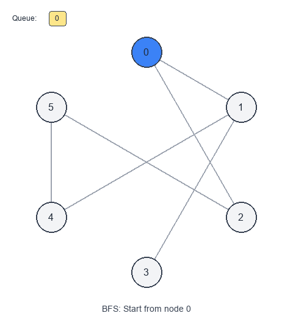

# Graph Traversal - Breadth First Search (BFS)

**BFS** explores a graph in expanding "layers" starting from a source node.

## Visual Example



BFS is especially powerful in **unweighted** graphs because the first time you reach a node is via the **shortest number of edges**.

When to use
- You need shortest path in an **unweighted** graph.
- You need minimum steps/moves (grid problems are often graphs).
- You need to explore by distance from a start node.

Key idea: queue + visited
- Use a queue to process nodes in the order they are discovered.
- Mark nodes visited when enqueuing (prevents duplicate enqueues).

Pattern recipe
1. Initialize a queue with the start node.
2. Mark start as visited.
3. While queue not empty:
   - pop a node
   - for each neighbor not visited:
     - mark visited
     - enqueue neighbor

Complexity
- Time: $O(V + E)$ (adjacency list)
- Space: $O(V)$ for visited + queue

Short examples

BFS traversal — Python

```python
from collections import deque

def bfs(g, start):
    visited = {start}
    q = deque([start])

    while q:
        u = q.popleft()
        for v in g[u]:
            if v in visited:
                continue
            visited.add(v)
            q.append(v)

    return visited
```

Shortest path length (unweighted) — Python

```python
from collections import deque

def shortest_path_length(g, src, dst):
    if src == dst:
        return 0

    visited = {src}
    q = deque([(src, 0)])

    while q:
        u, dist = q.popleft()
        for v in g[u]:
            if v in visited:
                continue
            if v == dst:
                return dist + 1
            visited.add(v)
            q.append((v, dist + 1))

    return -1
```

Multi-source BFS (concept)
Use when multiple starting points spread simultaneously (rotting oranges, 0-1 matrix).
- Initialize queue with all sources at distance 0.
- BFS as normal.

Problems to practice
- [Find if Path Exists in Graph](https://leetcode.com/problems/find-if-path-exists-in-graph/)
- [Shortest Path in Binary Matrix](https://leetcode.com/problems/shortest-path-in-binary-matrix/)
- [Rotting Oranges](https://leetcode.com/problems/rotting-oranges/)
- [01 Matrix](https://leetcode.com/problems/01-matrix/)
- [Bus Routes](https://leetcode.com/problems/bus-routes/)
