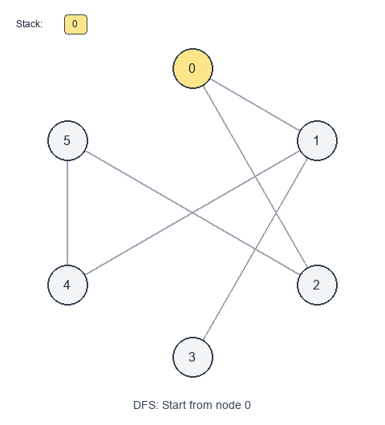

# Introduction to Graph

A **graph** models relationships between objects.

## Visual Examples

### Breadth-First Search (BFS)


### Depth-First Search (DFS)

- **Vertices (nodes)** represent entities.
- **Edges** represent connections between entities.

Graphs are more general than trees:
- Trees have no cycles and exactly one path between nodes.
- Graphs can have **cycles**, multiple paths, disconnected components, and directed edges.

Key graph types
- **Undirected**: edges go both ways (friendships).
- **Directed (digraph)**: edges have a direction (prerequisites, one-way roads).
- **Weighted**: edges have costs (distance, time).
- **Unweighted**: every edge cost is the same.

When to use
- The problem describes **relationships** (“connected to”, “can reach”, “depends on”).
- You need to find:
  - reachability (“is there a path?”)
  - shortest path (especially in unweighted graphs)
  - connected components
  - cycles
  - ordering constraints (topological order)

Common graph representations

Adjacency list (most common)
- Store for each node a list of neighbors.
- Great for sparse graphs.
- Space: $O(V + E)$.

Adjacency matrix
- `matrix[u][v]` indicates whether edge exists (or stores weight).
- Great for dense graphs and fast edge checks.
- Space: $O(V^2)$.

Pattern recipes

Graph traversal (DFS)
1. Keep a `visited` set/array.
2. Visit a node, mark visited.
3. Recurse (or stack) through neighbors.

Graph traversal (BFS)
1. Keep a `visited` set/array.
2. Use a queue.
3. BFS explores in “layers”, which gives shortest path lengths in **unweighted** graphs.

Complexity
- DFS/BFS Time: $O(V + E)$ with adjacency lists.
- DFS/BFS Space: $O(V)$ for visited + recursion/queue.

Short examples

Build an undirected adjacency list — Python

```python
from collections import defaultdict

def build_undirected_graph(n, edges):
    g = defaultdict(list)
    for u, v in edges:
        g[u].append(v)
        g[v].append(u)
    return g
```

DFS (recursive) — Python

```python
def dfs(g, start):
    visited = set()

    def go(u):
        visited.add(u)
        for v in g[u]:
            if v not in visited:
                go(v)

    go(start)
    return visited
```

BFS shortest path (unweighted) — Python

```python
from collections import deque

def shortest_path_length(g, src, dst):
    if src == dst:
        return 0

    q = deque([(src, 0)])
    visited = {src}

    while q:
        u, d = q.popleft()
        for v in g[u]:
            if v in visited:
                continue
            if v == dst:
                return d + 1
            visited.add(v)
            q.append((v, d + 1))

    return -1
```

Problems to practice
- [Find if Path Exists in Graph](https://leetcode.com/problems/find-if-path-exists-in-graph/)
- [Number of Provinces](https://leetcode.com/problems/number-of-provinces/)
- [Find Eventual Safe States](https://leetcode.com/problems/find-eventual-safe-states/)
- [Course Schedule](https://leetcode.com/problems/course-schedule/) (cycle detection in directed graph)
- [Course Schedule II](https://leetcode.com/problems/course-schedule-ii/) (topological order)
