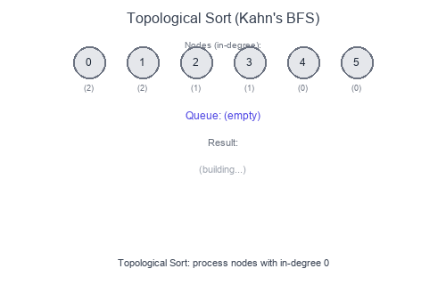

# Introduction to Topological Sort

**Topological Sort** orders vertices of a Directed Acyclic Graph (DAG) such that for every edge `u → v`, vertex `u` comes before `v`. It's essential for dependency resolution—determining the order to process tasks with prerequisites.

## Visual Example

### Topological Sort with Kahn's Algorithm (BFS)


Start with nodes having no incoming edges (in-degree = 0). Process them, remove their edges, and repeat. If all nodes are processed, we have a valid ordering.

## Key Insight

Topological sort only works on **DAGs** (Directed Acyclic Graphs). If there's a cycle, no valid ordering exists.

## When to Use

- Task scheduling with dependencies.
- Build systems (compile order).
- Course prerequisites.
- Package dependency resolution.
- Detecting cycles in directed graphs.
- Finding the order of compilation.

## Two Approaches

### 1. Kahn's Algorithm (BFS)
- Track in-degrees
- Process nodes with in-degree 0
- Remove edges, update in-degrees
- Repeat

### 2. DFS-based
- Visit nodes with DFS
- Add to result after all descendants visited
- Reverse the result

## Complexity

- Time: $O(V + E)$
- Space: $O(V)$ for in-degree array and queue/stack

## Short Examples — Python

### Kahn's Algorithm (BFS)

```python
from collections import deque, defaultdict

def topological_sort_bfs(num_nodes: int, edges: list[list[int]]) -> list[int]:
    """
    edges[i] = [a, b] means a → b (a must come before b)
    Returns empty list if cycle detected.
    """
    # Build adjacency list and in-degree count
    graph = defaultdict(list)
    in_degree = [0] * num_nodes

    for a, b in edges:
        graph[a].append(b)
        in_degree[b] += 1

    # Start with nodes having no prerequisites
    queue = deque([i for i in range(num_nodes) if in_degree[i] == 0])
    result = []

    while queue:
        node = queue.popleft()
        result.append(node)

        for neighbor in graph[node]:
            in_degree[neighbor] -= 1
            if in_degree[neighbor] == 0:
                queue.append(neighbor)

    # If not all nodes processed, there's a cycle
    return result if len(result) == num_nodes else []

# Example: 4 nodes, edges [[0,1], [0,2], [1,3], [2,3]]
# → [0, 1, 2, 3] or [0, 2, 1, 3]
```

### DFS-based Topological Sort

```python
from collections import defaultdict

def topological_sort_dfs(num_nodes: int, edges: list[list[int]]) -> list[int]:
    graph = defaultdict(list)
    for a, b in edges:
        graph[a].append(b)

    # 0: unvisited, 1: visiting, 2: visited
    state = [0] * num_nodes
    result = []
    has_cycle = False

    def dfs(node: int):
        nonlocal has_cycle
        if has_cycle:
            return

        state[node] = 1  # Visiting

        for neighbor in graph[node]:
            if state[neighbor] == 1:  # Back edge = cycle
                has_cycle = True
                return
            if state[neighbor] == 0:
                dfs(neighbor)

        state[node] = 2  # Visited
        result.append(node)

    for i in range(num_nodes):
        if state[i] == 0:
            dfs(i)

    return result[::-1] if not has_cycle else []
```

### Course Schedule (Can Finish?)

```python
def can_finish(num_courses: int, prerequisites: list[list[int]]) -> bool:
    """
    prerequisites[i] = [a, b] means must take b before a
    """
    graph = defaultdict(list)
    in_degree = [0] * num_courses

    for course, prereq in prerequisites:
        graph[prereq].append(course)
        in_degree[course] += 1

    queue = deque([i for i in range(num_courses) if in_degree[i] == 0])
    count = 0

    while queue:
        node = queue.popleft()
        count += 1

        for neighbor in graph[node]:
            in_degree[neighbor] -= 1
            if in_degree[neighbor] == 0:
                queue.append(neighbor)

    return count == num_courses

# Example: 2 courses, [[1,0]] → True (take 0, then 1)
# Example: 2 courses, [[1,0], [0,1]] → False (cycle)
```

### Course Schedule II (Return Order)

```python
def find_order(num_courses: int, prerequisites: list[list[int]]) -> list[int]:
    graph = defaultdict(list)
    in_degree = [0] * num_courses

    for course, prereq in prerequisites:
        graph[prereq].append(course)
        in_degree[course] += 1

    queue = deque([i for i in range(num_courses) if in_degree[i] == 0])
    order = []

    while queue:
        course = queue.popleft()
        order.append(course)

        for next_course in graph[course]:
            in_degree[next_course] -= 1
            if in_degree[next_course] == 0:
                queue.append(next_course)

    return order if len(order) == num_courses else []
```

### All Topological Orderings

```python
def all_topological_sorts(num_nodes: int, edges: list[list[int]]) -> list[list[int]]:
    graph = defaultdict(list)
    in_degree = [0] * num_nodes

    for a, b in edges:
        graph[a].append(b)
        in_degree[b] += 1

    result = []

    def backtrack(path: list[int], in_deg: list[int]):
        if len(path) == num_nodes:
            result.append(path[:])
            return

        for node in range(num_nodes):
            if in_deg[node] == 0 and node not in path:
                # Choose this node
                path.append(node)
                for neighbor in graph[node]:
                    in_deg[neighbor] -= 1

                backtrack(path, in_deg)

                # Backtrack
                path.pop()
                for neighbor in graph[node]:
                    in_deg[neighbor] += 1

    backtrack([], in_degree[:])
    return result
```

### Alien Dictionary (Derive order from sorted words)

```python
def alien_order(words: list[str]) -> str:
    # Build graph from adjacent word comparisons
    graph = defaultdict(set)
    in_degree = {char: 0 for word in words for char in word}

    for i in range(len(words) - 1):
        w1, w2 = words[i], words[i + 1]
        min_len = min(len(w1), len(w2))

        # Invalid: prefix comes after longer word
        if len(w1) > len(w2) and w1[:min_len] == w2[:min_len]:
            return ""

        for j in range(min_len):
            if w1[j] != w2[j]:
                if w2[j] not in graph[w1[j]]:
                    graph[w1[j]].add(w2[j])
                    in_degree[w2[j]] += 1
                break

    # Kahn's algorithm
    queue = deque([c for c in in_degree if in_degree[c] == 0])
    result = []

    while queue:
        char = queue.popleft()
        result.append(char)

        for neighbor in graph[char]:
            in_degree[neighbor] -= 1
            if in_degree[neighbor] == 0:
                queue.append(neighbor)

    return ''.join(result) if len(result) == len(in_degree) else ""

# Example: ["wrt", "wrf", "er", "ett", "rftt"] → "wertf"
```

## Kahn's vs DFS

| Aspect | Kahn's (BFS) | DFS |
|--------|--------------|-----|
| Approach | Process in-degree 0 first | Post-order reversal |
| Cycle detection | count < n | Back edge detection |
| Parallelization | Natural (batch same level) | Harder |
| Implementation | Slightly more code | Recursive, elegant |

## Common Pitfalls

- Forgetting to handle disconnected components.
- Not detecting cycles (infinite loop or wrong result).
- Wrong edge direction (a→b means a before b, not after).
- Assuming single valid ordering (there may be many).

## Problems to Practice

- [Course Schedule](https://leetcode.com/problems/course-schedule/)
- [Course Schedule II](https://leetcode.com/problems/course-schedule-ii/)
- [Alien Dictionary](https://leetcode.com/problems/alien-dictionary/)
- [Sequence Reconstruction](https://leetcode.com/problems/sequence-reconstruction/)
- [Minimum Height Trees](https://leetcode.com/problems/minimum-height-trees/)
- [Parallel Courses](https://leetcode.com/problems/parallel-courses/)
