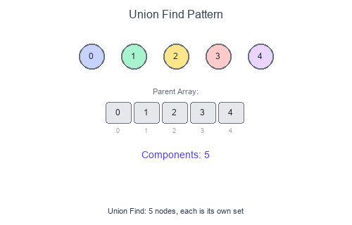

# Introduction to Union Find Pattern

**Union Find** (Disjoint Set Union / DSU) is a data structure that tracks elements partitioned into disjoint sets. It supports two operations efficiently: **Union** (merge two sets) and **Find** (determine which set an element belongs to).

## Visual Example

### Union Find with Path Compression


Initially, each element is its own set. Union operations merge sets by connecting roots. Path compression flattens the tree during Find operations.

## Core Operations

| Operation | Description | Optimized Time |
|-----------|-------------|----------------|
| `find(x)` | Find root/representative of x's set | ~O(1) amortized |
| `union(x, y)` | Merge sets containing x and y | ~O(1) amortized |
| `connected(x, y)` | Check if x and y in same set | ~O(1) amortized |

## When to Use

- Dynamic connectivity queries.
- Finding connected components.
- Cycle detection in undirected graphs.
- Kruskal's minimum spanning tree.
- Accounts merge / friend circles.
- Grid problems (islands with union).

## Key Optimizations

1. **Path Compression**: During `find()`, make each node point directly to root.
2. **Union by Rank/Size**: Attach smaller tree under larger tree's root.

Together, these achieve nearly O(1) amortized time per operation (technically O(α(n)) where α is the inverse Ackermann function).

## Short Examples — Python

### Basic Union Find

```python
class UnionFind:
    def __init__(self, n: int):
        self.parent = list(range(n))
        self.rank = [0] * n

    def find(self, x: int) -> int:
        if self.parent[x] != x:
            self.parent[x] = self.find(self.parent[x])  # Path compression
        return self.parent[x]

    def union(self, x: int, y: int) -> bool:
        """Returns True if x and y were in different sets."""
        root_x, root_y = self.find(x), self.find(y)

        if root_x == root_y:
            return False  # Already connected

        # Union by rank
        if self.rank[root_x] < self.rank[root_y]:
            root_x, root_y = root_y, root_x
        self.parent[root_y] = root_x

        if self.rank[root_x] == self.rank[root_y]:
            self.rank[root_x] += 1

        return True

    def connected(self, x: int, y: int) -> bool:
        return self.find(x) == self.find(y)
```

### Union Find with Size Tracking

```python
class UnionFindWithSize:
    def __init__(self, n: int):
        self.parent = list(range(n))
        self.size = [1] * n
        self.num_components = n

    def find(self, x: int) -> int:
        if self.parent[x] != x:
            self.parent[x] = self.find(self.parent[x])
        return self.parent[x]

    def union(self, x: int, y: int) -> bool:
        root_x, root_y = self.find(x), self.find(y)

        if root_x == root_y:
            return False

        # Union by size
        if self.size[root_x] < self.size[root_y]:
            root_x, root_y = root_y, root_x

        self.parent[root_y] = root_x
        self.size[root_x] += self.size[root_y]
        self.num_components -= 1

        return True

    def get_size(self, x: int) -> int:
        return self.size[self.find(x)]

    def count_components(self) -> int:
        return self.num_components
```

### Number of Connected Components

```python
def count_components(n: int, edges: list[list[int]]) -> int:
    uf = UnionFind(n)

    for a, b in edges:
        uf.union(a, b)

    # Count unique roots
    return len(set(uf.find(i) for i in range(n)))

# Or using the component counter:
def count_components_v2(n: int, edges: list[list[int]]) -> int:
    uf = UnionFindWithSize(n)
    for a, b in edges:
        uf.union(a, b)
    return uf.count_components()
```

### Redundant Connection (Find cycle edge)

```python
def find_redundant_connection(edges: list[list[int]]) -> list[int]:
    """Find the edge that creates a cycle."""
    n = len(edges)
    uf = UnionFind(n + 1)  # 1-indexed

    for a, b in edges:
        if not uf.union(a, b):
            return [a, b]  # Already connected = cycle

    return []

# Example: [[1,2], [1,3], [2,3]] → [2,3]
```

### Number of Provinces (Friend Circles)

```python
def find_circle_num(is_connected: list[list[int]]) -> int:
    n = len(is_connected)
    uf = UnionFind(n)

    for i in range(n):
        for j in range(i + 1, n):
            if is_connected[i][j]:
                uf.union(i, j)

    return len(set(uf.find(i) for i in range(n)))
```

### Accounts Merge

```python
from collections import defaultdict

def accounts_merge(accounts: list[list[str]]) -> list[list[str]]:
    email_to_id = {}
    email_to_name = {}
    uf = UnionFind(len(accounts) * 10)  # Upper bound on emails
    email_id = 0

    # Assign IDs and union emails within same account
    for account in accounts:
        name = account[0]
        first_email_id = None

        for email in account[1:]:
            if email not in email_to_id:
                email_to_id[email] = email_id
                email_to_name[email] = name
                email_id += 1

            if first_email_id is None:
                first_email_id = email_to_id[email]
            else:
                uf.union(first_email_id, email_to_id[email])

    # Group emails by root
    groups = defaultdict(list)
    for email, eid in email_to_id.items():
        root = uf.find(eid)
        groups[root].append(email)

    # Format result
    result = []
    for root, emails in groups.items():
        name = email_to_name[emails[0]]
        result.append([name] + sorted(emails))

    return result
```

### Number of Islands (Union Find approach)

```python
def num_islands_uf(grid: list[list[str]]) -> int:
    if not grid:
        return 0

    rows, cols = len(grid), len(grid[0])

    def get_id(r: int, c: int) -> int:
        return r * cols + c

    uf = UnionFind(rows * cols)
    land_count = 0

    for r in range(rows):
        for c in range(cols):
            if grid[r][c] == '1':
                land_count += 1

                # Union with adjacent land cells
                for dr, dc in [(0, 1), (1, 0)]:
                    nr, nc = r + dr, c + dc
                    if 0 <= nr < rows and 0 <= nc < cols and grid[nr][nc] == '1':
                        if uf.union(get_id(r, c), get_id(nr, nc)):
                            land_count -= 1

    return land_count
```

### Graph Valid Tree

```python
def valid_tree(n: int, edges: list[list[int]]) -> bool:
    """A valid tree has n-1 edges and is fully connected."""
    if len(edges) != n - 1:
        return False

    uf = UnionFind(n)
    for a, b in edges:
        if not uf.union(a, b):
            return False  # Cycle detected

    return True
```

## Union Find vs DFS/BFS

| Aspect | Union Find | DFS/BFS |
|--------|------------|---------|
| Dynamic edges | Excellent | Rebuild graph |
| Static components | Good | Also good |
| Online queries | O(1) per query | O(V+E) per query |
| Implementation | Moderate | Simple |

## Common Pitfalls

- Forgetting path compression (performance degrades).
- Off-by-one with node indices (0-indexed vs 1-indexed).
- Not handling the "already connected" case in union.
- Using union-find for directed graphs (it's for undirected).

## Problems to Practice

- [Number of Provinces](https://leetcode.com/problems/number-of-provinces/)
- [Redundant Connection](https://leetcode.com/problems/redundant-connection/)
- [Accounts Merge](https://leetcode.com/problems/accounts-merge/)
- [Number of Connected Components](https://leetcode.com/problems/number-of-connected-components-in-an-undirected-graph/)
- [Graph Valid Tree](https://leetcode.com/problems/graph-valid-tree/)
- [Longest Consecutive Sequence](https://leetcode.com/problems/longest-consecutive-sequence/)
- [Satisfiability of Equality Equations](https://leetcode.com/problems/satisfiability-of-equality-equations/)
