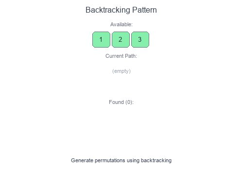

# Introduction to Backtracking Pattern

**Backtracking** is a systematic way to explore all possible solutions by building candidates incrementally and abandoning ("backtracking") paths that cannot lead to valid solutions. Think of it as a depth-first search through a decision tree.

## Visual Example

### Generating Permutations with Backtracking


At each step, we make a choice, explore further, then **undo** the choice (backtrack) to try other options. Invalid paths are pruned early.

## Core Concept

```
backtrack(state):
    if is_solution(state):
        record solution
        return

    for choice in get_choices(state):
        if is_valid(choice):
            make_choice(choice)
            backtrack(new_state)
            undo_choice(choice)  # BACKTRACK
```

## When to Use

- Generate all permutations or combinations.
- Solve constraint satisfaction (Sudoku, N-Queens).
- Find all paths in a graph/tree.
- Partition problems (equal subset sums).
- Word search in a grid.
- Any "find all solutions" or "can we reach X?" problem.

## Pattern Recipe

1. **Define the state**: What information tracks your progress?
2. **Define the goal**: When is a path complete/valid?
3. **Define choices**: What options exist at each step?
4. **Prune invalid paths**: Skip choices that can't lead to solutions.
5. **Backtrack**: Undo changes after exploring a path.

## Complexity

- Time: Often $O(n!)$ or $O(2^n)$ — exponential by nature
- Space: $O(n)$ for recursion depth (plus output storage)

## Short Examples — Python

### Permutations

```python
def permutations(nums: list[int]) -> list[list[int]]:
    result = []

    def backtrack(path: list[int], remaining: set[int]):
        if not remaining:
            result.append(path[:])
            return

        for num in list(remaining):
            path.append(num)
            remaining.remove(num)
            backtrack(path, remaining)
            remaining.add(num)       # Backtrack
            path.pop()               # Backtrack

    backtrack([], set(nums))
    return result

# [1,2,3] → [[1,2,3], [1,3,2], [2,1,3], [2,3,1], [3,1,2], [3,2,1]]
```

### Combinations

```python
def combinations(n: int, k: int) -> list[list[int]]:
    result = []

    def backtrack(start: int, path: list[int]):
        if len(path) == k:
            result.append(path[:])
            return

        for i in range(start, n + 1):
            path.append(i)
            backtrack(i + 1, path)
            path.pop()  # Backtrack

    backtrack(1, [])
    return result

# n=4, k=2 → [[1,2], [1,3], [1,4], [2,3], [2,4], [3,4]]
```

### Subsets

```python
def subsets(nums: list[int]) -> list[list[int]]:
    result = []

    def backtrack(start: int, path: list[int]):
        result.append(path[:])  # Every path is a valid subset

        for i in range(start, len(nums)):
            path.append(nums[i])
            backtrack(i + 1, path)
            path.pop()  # Backtrack

    backtrack(0, [])
    return result

# [1,2,3] → [[], [1], [1,2], [1,2,3], [1,3], [2], [2,3], [3]]
```

### Combination Sum (with reuse)

```python
def combination_sum(candidates: list[int], target: int) -> list[list[int]]:
    result = []

    def backtrack(start: int, path: list[int], remaining: int):
        if remaining == 0:
            result.append(path[:])
            return
        if remaining < 0:
            return

        for i in range(start, len(candidates)):
            path.append(candidates[i])
            backtrack(i, path, remaining - candidates[i])  # Can reuse
            path.pop()

    backtrack(0, [], target)
    return result

# [2,3,6,7], target=7 → [[2,2,3], [7]]
```

### N-Queens

```python
def solve_n_queens(n: int) -> list[list[str]]:
    result = []
    board = [['.'] * n for _ in range(n)]

    def is_safe(row: int, col: int) -> bool:
        # Check column
        for i in range(row):
            if board[i][col] == 'Q':
                return False

        # Check diagonals
        for i, j in zip(range(row-1, -1, -1), range(col-1, -1, -1)):
            if board[i][j] == 'Q':
                return False
        for i, j in zip(range(row-1, -1, -1), range(col+1, n)):
            if board[i][j] == 'Q':
                return False

        return True

    def backtrack(row: int):
        if row == n:
            result.append([''.join(r) for r in board])
            return

        for col in range(n):
            if is_safe(row, col):
                board[row][col] = 'Q'
                backtrack(row + 1)
                board[row][col] = '.'  # Backtrack

    backtrack(0)
    return result
```

### Word Search

```python
def word_search(board: list[list[str]], word: str) -> bool:
    rows, cols = len(board), len(board[0])

    def backtrack(r: int, c: int, idx: int) -> bool:
        if idx == len(word):
            return True

        if (r < 0 or r >= rows or c < 0 or c >= cols or
            board[r][c] != word[idx]):
            return False

        # Mark as visited
        temp = board[r][c]
        board[r][c] = '#'

        # Explore all directions
        found = (backtrack(r+1, c, idx+1) or
                 backtrack(r-1, c, idx+1) or
                 backtrack(r, c+1, idx+1) or
                 backtrack(r, c-1, idx+1))

        board[r][c] = temp  # Backtrack
        return found

    for r in range(rows):
        for c in range(cols):
            if backtrack(r, c, 0):
                return True
    return False
```

### Sudoku Solver

```python
def solve_sudoku(board: list[list[str]]) -> bool:
    def is_valid(row: int, col: int, num: str) -> bool:
        # Check row and column
        for i in range(9):
            if board[row][i] == num or board[i][col] == num:
                return False

        # Check 3x3 box
        box_row, box_col = 3 * (row // 3), 3 * (col // 3)
        for i in range(box_row, box_row + 3):
            for j in range(box_col, box_col + 3):
                if board[i][j] == num:
                    return False

        return True

    def backtrack() -> bool:
        for r in range(9):
            for c in range(9):
                if board[r][c] == '.':
                    for num in '123456789':
                        if is_valid(r, c, num):
                            board[r][c] = num
                            if backtrack():
                                return True
                            board[r][c] = '.'  # Backtrack
                    return False  # No valid number
        return True  # All cells filled

    backtrack()
```

## Backtracking vs Other Approaches

| Approach | Use When |
|----------|----------|
| Backtracking | Need ALL solutions or checking existence |
| DP | Counting solutions or optimization |
| Greedy | Local optimal leads to global optimal |
| BFS | Shortest path / level-order exploration |

## Common Pitfalls

- Forgetting to backtrack (undo changes).
- Not pruning invalid paths early (causes TLE).
- Modifying shared state without proper cleanup.
- Off-by-one errors with indices.

## Problems to Practice

- [Permutations](https://leetcode.com/problems/permutations/)
- [Combinations](https://leetcode.com/problems/combinations/)
- [Subsets](https://leetcode.com/problems/subsets/)
- [Combination Sum](https://leetcode.com/problems/combination-sum/)
- [N-Queens](https://leetcode.com/problems/n-queens/)
- [Word Search](https://leetcode.com/problems/word-search/)
- [Sudoku Solver](https://leetcode.com/problems/sudoku-solver/)
- [Palindrome Partitioning](https://leetcode.com/problems/palindrome-partitioning/)
- [Letter Combinations of a Phone Number](https://leetcode.com/problems/letter-combinations-of-a-phone-number/)
