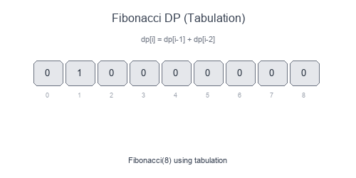

# Introduction to Fibonacci Numbers (Dynamic Programming)

The **Fibonacci DP** pattern covers problems where the solution at step `n` depends on solutions from the previous few steps (typically `n-1` and `n-2`). These are the simplest DP problems and a great starting point for learning dynamic programming.

## Visual Example

### Fibonacci with Memoization


Without memoization, calculating `fib(5)` recomputes `fib(3)` twice, `fib(2)` three times, etc. With DP, each value is computed only once.

## The Recurrence Pattern

```
f(n) = f(n-1) + f(n-2)    # Fibonacci
f(n) = f(n-1) + f(n-2) + f(n-3)    # Tribonacci
f(n) = min(f(n-1), f(n-2)) + cost[n]    # Min cost
```

## When to Use

- Counting ways to reach a target (stairs, paths).
- Problems with "previous state" dependencies.
- Optimization over linear sequences.
- Any recurrence involving the last 1-3 states.

## Pattern Recipe

1. **Identify the recurrence**: How does `f(n)` relate to previous values?
2. **Define base cases**: `f(0)`, `f(1)`, etc.
3. **Choose approach**:
   - Top-down with memoization
   - Bottom-up with tabulation
   - Space-optimized with variables
4. **Implement** and return `f(n)`.

## Complexity

- Time: $O(n)$ — each state computed once
- Space: $O(n)$ for table, or $O(1)$ with space optimization

## Short Examples — Python

### Classic Fibonacci

```python
# Naive recursive - O(2^n) - DON'T USE
def fib_naive(n: int) -> int:
    if n <= 1:
        return n
    return fib_naive(n-1) + fib_naive(n-2)

# Top-down with memoization - O(n)
def fib_memo(n: int, memo: dict = None) -> int:
    if memo is None:
        memo = {}
    if n <= 1:
        return n
    if n not in memo:
        memo[n] = fib_memo(n-1, memo) + fib_memo(n-2, memo)
    return memo[n]

# Bottom-up tabulation - O(n)
def fib_table(n: int) -> int:
    if n <= 1:
        return n
    dp = [0] * (n + 1)
    dp[1] = 1
    for i in range(2, n + 1):
        dp[i] = dp[i-1] + dp[i-2]
    return dp[n]

# Space-optimized - O(1) space
def fib_optimized(n: int) -> int:
    if n <= 1:
        return n
    prev2, prev1 = 0, 1
    for _ in range(2, n + 1):
        curr = prev1 + prev2
        prev2, prev1 = prev1, curr
    return prev1
```

### Climbing Stairs

```python
def climb_stairs(n: int) -> int:
    """Count ways to climb n stairs taking 1 or 2 steps at a time."""
    if n <= 2:
        return n

    prev2, prev1 = 1, 2
    for _ in range(3, n + 1):
        curr = prev1 + prev2
        prev2, prev1 = prev1, curr

    return prev1

# Example: n=4 → 5 ways: [1,1,1,1], [1,1,2], [1,2,1], [2,1,1], [2,2]
```

### Min Cost Climbing Stairs

```python
def min_cost_climbing(cost: list[int]) -> int:
    """Minimum cost to reach the top (can start at index 0 or 1)."""
    n = len(cost)
    if n <= 2:
        return min(cost)

    prev2, prev1 = cost[0], cost[1]
    for i in range(2, n):
        curr = cost[i] + min(prev1, prev2)
        prev2, prev1 = prev1, curr

    return min(prev1, prev2)  # Can skip last step

# Example: [10, 15, 20] → 15 (start at index 1, jump to top)
```

### House Robber

```python
def rob(nums: list[int]) -> int:
    """Max sum of non-adjacent elements."""
    if not nums:
        return 0
    if len(nums) == 1:
        return nums[0]

    prev2, prev1 = 0, nums[0]
    for i in range(1, len(nums)):
        curr = max(prev1, prev2 + nums[i])
        prev2, prev1 = prev1, curr

    return prev1

# Example: [2, 7, 9, 3, 1] → 12 (rob houses 0, 2, 4: 2+9+1)
```

### Decode Ways

```python
def num_decodings(s: str) -> int:
    """Count ways to decode '12' → 'AB' or 'L'."""
    if not s or s[0] == '0':
        return 0

    n = len(s)
    prev2, prev1 = 1, 1  # dp[0] = 1, dp[1] = 1

    for i in range(1, n):
        curr = 0

        # Single digit (1-9)
        if s[i] != '0':
            curr += prev1

        # Two digits (10-26)
        two_digit = int(s[i-1:i+1])
        if 10 <= two_digit <= 26:
            curr += prev2

        prev2, prev1 = prev1, curr

    return prev1

# Example: "226" → 3 ways: "BZ", "VF", "BBF"
```

### Minimum Jumps to End

```python
def min_jumps(nums: list[int]) -> int:
    """Minimum jumps to reach last index."""
    n = len(nums)
    if n <= 1:
        return 0

    jumps = 0
    current_end = 0
    farthest = 0

    for i in range(n - 1):
        farthest = max(farthest, i + nums[i])

        if i == current_end:
            jumps += 1
            current_end = farthest

            if current_end >= n - 1:
                break

    return jumps

# Example: [2,3,1,1,4] → 2 jumps (0→1→4)
```

## Common Variants

| Problem | Recurrence | Base Case |
|---------|------------|-----------|
| Fibonacci | `f(n) = f(n-1) + f(n-2)` | `f(0)=0, f(1)=1` |
| Stairs (1 or 2 steps) | `f(n) = f(n-1) + f(n-2)` | `f(1)=1, f(2)=2` |
| Stairs (1, 2, or 3 steps) | `f(n) = f(n-1) + f(n-2) + f(n-3)` | `f(1)=1, f(2)=2, f(3)=4` |
| House Robber | `f(n) = max(f(n-1), f(n-2)+nums[n])` | `f(0)=nums[0]` |
| Min Cost | `f(n) = min(f(n-1), f(n-2)) + cost[n]` | `f(0)=cost[0]` |

## Common Pitfalls

- Forgetting base cases (especially `n=0` and `n=1`).
- Off-by-one errors with array indices.
- Not handling edge cases (empty input, single element).
- Stack overflow with naive recursion on large inputs.

## Problems to Practice

- [Fibonacci Number](https://leetcode.com/problems/fibonacci-number/)
- [Climbing Stairs](https://leetcode.com/problems/climbing-stairs/)
- [Min Cost Climbing Stairs](https://leetcode.com/problems/min-cost-climbing-stairs/)
- [House Robber](https://leetcode.com/problems/house-robber/)
- [House Robber II](https://leetcode.com/problems/house-robber-ii/)
- [Decode Ways](https://leetcode.com/problems/decode-ways/)
- [Jump Game II](https://leetcode.com/problems/jump-game-ii/)
- [Tribonacci Number](https://leetcode.com/problems/n-th-tribonacci-number/)
