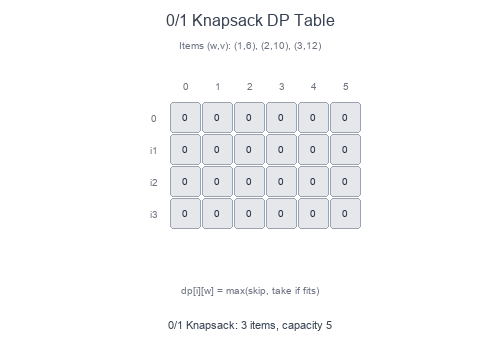

# Introduction to 0/1 Knapsack Pattern (Dynamic Programming)

The **0/1 Knapsack** pattern is a foundational dynamic programming technique for optimization problems where you must decide whether to **include or exclude** each item (hence "0/1"—you can't take fractions).

## Visual Example

### DP Table for Knapsack


Each cell `dp[i][w]` represents the maximum value achievable using the first `i` items with capacity `w`. For each item, we choose: **take it** (if it fits) or **skip it**.

## What is Dynamic Programming?

DP solves problems by:
1. Breaking them into **overlapping subproblems**
2. Storing results to avoid recomputation (**memoization** or **tabulation**)
3. Building solutions from smaller subproblems (**optimal substructure**)

## When to Use 0/1 Knapsack Pattern

- Select items with constraints (weight, cost, time).
- Partition problems (can we split into equal subsets?).
- Subset sum problems (can we reach a target sum?).
- Counting subsets with specific properties.
- Minimization/maximization with binary choices.

## Pattern Recipe

### Top-Down (Memoization)
1. Define recursive function with state (index, remaining capacity).
2. Base case: no items left or no capacity.
3. For each item: `max(skip, take if fits)`.
4. Cache results in a memo dictionary.

### Bottom-Up (Tabulation)
1. Create DP table: `dp[n+1][capacity+1]`.
2. Initialize base cases (0 items or 0 capacity = 0 value).
3. Fill table row by row.
4. Answer is `dp[n][capacity]`.

## Complexity

- Time: $O(n \times W)$ where n = items, W = capacity
- Space: $O(n \times W)$ for 2D table, or $O(W)$ with space optimization

## Short Examples — Python

### Classic 0/1 Knapsack

```python
def knapsack(weights: list[int], values: list[int], capacity: int) -> int:
    n = len(weights)
    dp = [[0] * (capacity + 1) for _ in range(n + 1)]

    for i in range(1, n + 1):
        for w in range(capacity + 1):
            # Skip item i-1
            dp[i][w] = dp[i-1][w]

            # Take item i-1 (if it fits)
            if weights[i-1] <= w:
                dp[i][w] = max(
                    dp[i][w],
                    dp[i-1][w - weights[i-1]] + values[i-1]
                )

    return dp[n][capacity]

# Example:
# weights = [1, 2, 3], values = [6, 10, 12], capacity = 5
# → 22 (take items with weights 2 and 3)
```

### Space-Optimized (1D Array)

```python
def knapsack_optimized(weights: list[int], values: list[int], capacity: int) -> int:
    dp = [0] * (capacity + 1)

    for i in range(len(weights)):
        # Traverse right to left to avoid using updated values
        for w in range(capacity, weights[i] - 1, -1):
            dp[w] = max(dp[w], dp[w - weights[i]] + values[i])

    return dp[capacity]
```

### Subset Sum (Can we reach target?)

```python
def can_partition(nums: list[int], target: int) -> bool:
    dp = [False] * (target + 1)
    dp[0] = True  # Empty subset sums to 0

    for num in nums:
        for t in range(target, num - 1, -1):
            dp[t] = dp[t] or dp[t - num]

    return dp[target]
```

### Equal Subset Partition

```python
def can_equal_partition(nums: list[int]) -> bool:
    total = sum(nums)

    # Can't split odd sum equally
    if total % 2 != 0:
        return False

    target = total // 2
    dp = [False] * (target + 1)
    dp[0] = True

    for num in nums:
        for t in range(target, num - 1, -1):
            dp[t] = dp[t] or dp[t - num]

    return dp[target]
```

### Count Subsets with Sum

```python
def count_subsets(nums: list[int], target: int) -> int:
    dp = [0] * (target + 1)
    dp[0] = 1  # One way to make sum 0: empty subset

    for num in nums:
        for t in range(target, num - 1, -1):
            dp[t] += dp[t - num]

    return dp[target]
```

### Minimum Subset Sum Difference

```python
def min_subset_diff(nums: list[int]) -> int:
    total = sum(nums)
    target = total // 2

    dp = [False] * (target + 1)
    dp[0] = True

    for num in nums:
        for t in range(target, num - 1, -1):
            dp[t] = dp[t] or dp[t - num]

    # Find largest sum <= total/2 that's achievable
    for t in range(target, -1, -1):
        if dp[t]:
            return total - 2 * t

    return total
```

## 0/1 Knapsack Variants

| Problem | State | Transition |
|---------|-------|------------|
| Classic Knapsack | `dp[i][w]` = max value | `max(skip, take)` |
| Subset Sum | `dp[sum]` = reachable? | `dp[t] or dp[t-num]` |
| Count Subsets | `dp[sum]` = count | `dp[t] += dp[t-num]` |
| Unbounded Knapsack | `dp[w]` (left to right) | Can take item multiple times |

## Common Pitfalls

- **Wrong traversal order**: For 0/1, traverse capacity **right to left** in 1D optimization.
- **Off-by-one errors**: Watch indices when translating from 2D to 1D.
- **Forgetting base case**: `dp[0] = True` or `dp[0] = 1` for counting.
- **Integer overflow**: Sum can exceed int range in some languages.

## DP Approach Comparison

| Approach | Pros | Cons |
|----------|------|------|
| Top-Down (Memo) | Natural recursion, only computes needed states | Recursion overhead, stack limits |
| Bottom-Up (Table) | No recursion, often faster | May compute unnecessary states |
| Space-Optimized | O(W) space | Can't reconstruct solution easily |

## Problems to Practice

- [0/1 Knapsack](https://www.geeksforgeeks.org/0-1-knapsack-problem-dp-10/)
- [Partition Equal Subset Sum](https://leetcode.com/problems/partition-equal-subset-sum/)
- [Target Sum](https://leetcode.com/problems/target-sum/)
- [Last Stone Weight II](https://leetcode.com/problems/last-stone-weight-ii/)
- [Ones and Zeroes](https://leetcode.com/problems/ones-and-zeroes/)
- [Coin Change](https://leetcode.com/problems/coin-change/) (unbounded variant)
