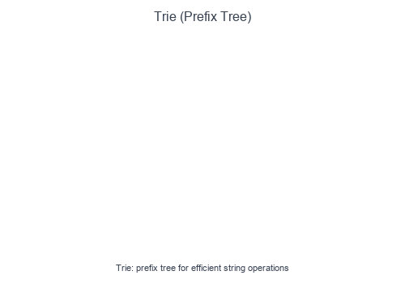

# Introduction to Trie

A **Trie** (prefix tree) is a tree-like data structure for efficient storage and retrieval of strings. Each node represents a character, and paths from root to nodes represent prefixes. Tries excel at prefix-based operations.

## Visual Example

### Trie Insert and Search


Words share common prefixes in the tree structure. Searching "app" traverses a→p→p. A marker indicates complete words vs. prefixes.

## Structure

```
        root
       / | \
      a  b  c
     /
    p
   / \
  p   e (ape✓)
  |
  l
  |
  e (apple✓)
```

## When to Use

- Autocomplete / search suggestions.
- Spell checking.
- Prefix matching (find all words starting with X).
- Word validation in games (Boggle, Scrabble).
- IP routing (longest prefix match).
- Counting unique prefixes.

## Core Operations

| Operation | Time | Description |
|-----------|------|-------------|
| Insert | $O(m)$ | Add word of length m |
| Search | $O(m)$ | Check if word exists |
| StartsWith | $O(m)$ | Check if prefix exists |
| Delete | $O(m)$ | Remove word |

## Pattern Recipe

1. **Node structure**: Dictionary of children + end-of-word marker.
2. **Insert**: Create nodes for each character if not present.
3. **Search**: Traverse character by character; check end marker.
4. **Prefix**: Same as search but don't check end marker.

## Short Examples — Python

### Basic Trie Implementation

```python
class TrieNode:
    def __init__(self):
        self.children = {}
        self.is_end = False

class Trie:
    def __init__(self):
        self.root = TrieNode()

    def insert(self, word: str) -> None:
        node = self.root
        for char in word:
            if char not in node.children:
                node.children[char] = TrieNode()
            node = node.children[char]
        node.is_end = True

    def search(self, word: str) -> bool:
        node = self._find_node(word)
        return node is not None and node.is_end

    def starts_with(self, prefix: str) -> bool:
        return self._find_node(prefix) is not None

    def _find_node(self, prefix: str) -> TrieNode:
        node = self.root
        for char in prefix:
            if char not in node.children:
                return None
            node = node.children[char]
        return node

# Usage:
# trie = Trie()
# trie.insert("apple")
# trie.search("apple")   → True
# trie.search("app")     → False
# trie.starts_with("app") → True
```

### Trie with Word Count

```python
class TrieWithCount:
    def __init__(self):
        self.root = {}

    def insert(self, word: str) -> None:
        node = self.root
        for char in word:
            node = node.setdefault(char, {})
        node['#'] = node.get('#', 0) + 1  # Count occurrences

    def count_word(self, word: str) -> int:
        node = self.root
        for char in word:
            if char not in node:
                return 0
            node = node[char]
        return node.get('#', 0)

    def count_prefix(self, prefix: str) -> int:
        """Count all words with this prefix."""
        node = self.root
        for char in prefix:
            if char not in node:
                return 0
            node = node[char]
        return self._count_all(node)

    def _count_all(self, node: dict) -> int:
        count = node.get('#', 0)
        for char, child in node.items():
            if char != '#':
                count += self._count_all(child)
        return count
```

### Word Search II (Find all words in board)

```python
def find_words(board: list[list[str]], words: list[str]) -> list[str]:
    # Build trie from word list
    trie = {}
    for word in words:
        node = trie
        for char in word:
            node = node.setdefault(char, {})
        node['$'] = word  # Store complete word

    rows, cols = len(board), len(board[0])
    result = set()

    def backtrack(r: int, c: int, node: dict):
        char = board[r][c]
        if char not in node:
            return

        next_node = node[char]

        # Found a word
        if '$' in next_node:
            result.add(next_node['$'])

        # Mark visited
        board[r][c] = '#'

        # Explore neighbors
        for dr, dc in [(0,1), (0,-1), (1,0), (-1,0)]:
            nr, nc = r + dr, c + dc
            if 0 <= nr < rows and 0 <= nc < cols and board[nr][nc] != '#':
                backtrack(nr, nc, next_node)

        board[r][c] = char  # Restore

    for r in range(rows):
        for c in range(cols):
            backtrack(r, c, trie)

    return list(result)
```

### Autocomplete System

```python
class AutocompleteSystem:
    def __init__(self, sentences: list[str], times: list[int]):
        self.trie = {}
        self.current_input = ""

        for sentence, count in zip(sentences, times):
            self._insert(sentence, count)

    def _insert(self, sentence: str, count: int):
        node = self.trie
        for char in sentence:
            node = node.setdefault(char, {})
        node['#'] = node.get('#', 0) + count

    def input(self, c: str) -> list[str]:
        if c == '#':
            self._insert(self.current_input, 1)
            self.current_input = ""
            return []

        self.current_input += c

        # Find all sentences with current prefix
        node = self.trie
        for char in self.current_input:
            if char not in node:
                return []
            node = node[char]

        # Collect all completions
        results = []
        self._collect(node, self.current_input, results)

        # Return top 3 by frequency, then alphabetically
        results.sort(key=lambda x: (-x[0], x[1]))
        return [s for _, s in results[:3]]

    def _collect(self, node: dict, prefix: str, results: list):
        if '#' in node:
            results.append((node['#'], prefix))
        for char, child in node.items():
            if char != '#':
                self._collect(child, prefix + char, results)
```

### Replace Words (Dictionary with prefixes)

```python
def replace_words(dictionary: list[str], sentence: str) -> str:
    # Build trie of roots
    trie = {}
    for root in dictionary:
        node = trie
        for char in root:
            node = node.setdefault(char, {})
        node['#'] = root

    def find_root(word: str) -> str:
        node = trie
        for char in word:
            if '#' in node:
                return node['#']  # Found shortest root
            if char not in node:
                return word  # No root found
            node = node[char]
        return node.get('#', word)

    return ' '.join(find_root(word) for word in sentence.split())

# dictionary = ["cat", "bat", "rat"]
# sentence = "the cattle was rattled by the battery"
# → "the cat was rat by the bat"
```

## Trie vs HashMap

| Aspect | Trie | HashMap |
|--------|------|---------|
| Prefix search | O(m) | O(n × m) scan all keys |
| Exact lookup | O(m) | O(m) average |
| Autocomplete | Natural | Requires extra work |
| Memory | Higher (pointers) | Lower |
| Sorted iteration | In-order traversal | Need to sort |

## Common Pitfalls

- Forgetting the end-of-word marker (mixing up prefix vs complete word).
- Not handling empty strings.
- Memory leaks when deleting (orphan nodes).
- Using wrong data structure for children (dict vs array).

## Problems to Practice

- [Implement Trie](https://leetcode.com/problems/implement-trie-prefix-tree/)
- [Design Add and Search Words](https://leetcode.com/problems/design-add-and-search-words-data-structure/)
- [Word Search II](https://leetcode.com/problems/word-search-ii/)
- [Replace Words](https://leetcode.com/problems/replace-words/)
- [Search Suggestions System](https://leetcode.com/problems/search-suggestions-system/)
- [Maximum XOR of Two Numbers](https://leetcode.com/problems/maximum-xor-of-two-numbers-in-an-array/) (bitwise trie)
