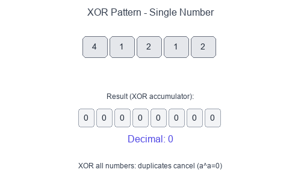

# Introduction to Bitwise XOR Pattern

The **Bitwise XOR** pattern leverages the unique properties of the XOR (`^`) operator to solve problems involving pairs, duplicates, and bit manipulation efficiently—often in $O(n)$ time and $O(1)$ space.

## Key XOR Properties

```
a ^ a = 0        # XOR with itself is 0
a ^ 0 = a        # XOR with 0 is itself
a ^ b = b ^ a    # Commutative
(a ^ b) ^ c = a ^ (b ^ c)  # Associative
```

## Visual Example

### Finding the Single Number


When you XOR all numbers together, duplicates cancel out (since `a ^ a = 0`), leaving only the unique number.

## When to Use

- Find a single unique element among duplicates (every other element appears twice).
- Find two unique elements among duplicates.
- Swap two numbers without a temporary variable.
- Toggle bits or check parity.
- Problems involving "missing" or "extra" numbers in a range.

## Pattern Recipe (Single Number)

1. Initialize `result = 0`.
2. XOR every element: `result ^= num`.
3. After processing all elements, `result` holds the single unique number.

## Complexity

- Time: $O(n)$ — single pass through array
- Space: $O(1)$ — only one variable needed

## Short Example — Python

### Single Number (find unique among pairs)

```python
def single_number(nums: list[int]) -> int:
    result = 0
    for num in nums:
        result ^= num
    return result

# Example: [4, 1, 2, 1, 2] → 4
```

### Two Single Numbers (find two uniques)

```python
def two_single_numbers(nums: list[int]) -> list[int]:
    # Step 1: XOR all → gives xor of the two unique numbers
    xor_all = 0
    for num in nums:
        xor_all ^= num

    # Step 2: Find rightmost set bit (differs between the two)
    rightmost_bit = xor_all & (-xor_all)

    # Step 3: Partition and XOR separately
    num1, num2 = 0, 0
    for num in nums:
        if num & rightmost_bit:
            num1 ^= num
        else:
            num2 ^= num

    return [num1, num2]
```

### Swap Without Temp Variable

```python
def swap(a: int, b: int) -> tuple[int, int]:
    a = a ^ b
    b = a ^ b  # b = (a ^ b) ^ b = a
    a = a ^ b  # a = (a ^ b) ^ a = b
    return a, b
```

## Common Pitfalls

- Forgetting that XOR only works for finding singles when **all other elements appear exactly twice**.
- For "two single numbers", you must partition using a differing bit—otherwise both numbers end up in the same group.
- Integer overflow isn't an issue in Python, but be careful in other languages with fixed-width integers.

## Problems to Practice

- [Single Number](https://leetcode.com/problems/single-number/)
- [Single Number II](https://leetcode.com/problems/single-number-ii/) (elements appear 3 times except one)
- [Single Number III](https://leetcode.com/problems/single-number-iii/) (two unique numbers)
- [Missing Number](https://leetcode.com/problems/missing-number/)
- [Complement of Base 10 Number](https://leetcode.com/problems/complement-of-base-10-integer/)
