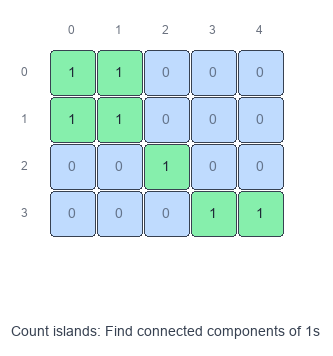
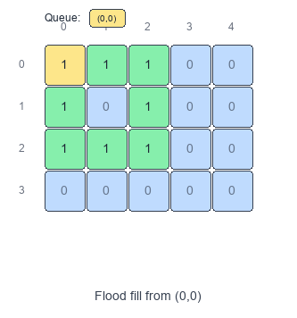

# Introduction to Island Pattern (Matrix Traversal)

The **Island pattern** is "graph connected components" on a 2D grid.

## Visual Examples

### Count Islands (BFS)


### Flood Fill


You’re usually given a matrix (grid) where each cell is either:
- **land / water** (e.g., `1` / `0`)
- **open / blocked**
- or some label/color you can transform

Two land cells are connected if they are adjacent (most commonly **4-directionally**: up/down/left/right; sometimes **8-directionally**).

## When to use

- You need to count connected regions (e.g., “number of islands”).
- You need to measure regions (largest island area/perimeter).
- You need to transform a region (flood fill, recolor, capture surrounded regions).
- You need to detect regions with constraints (closed islands, islands touching border).

## Core idea

- Treat each cell as a node.
- Edges connect neighboring cells.
- Run DFS/BFS from every unvisited “land” cell to mark the whole component.

## Pattern recipe

1. Decide the adjacency rule: 4-dir or 8-dir.
2. Keep a `visited` structure (or mark in-place if allowed).
3. Loop all cells:
   - if this cell is “land” and unvisited:
     - start DFS/BFS to visit the full component
     - update your answer (count += 1, area += size, etc.)

## Complexity

- Time: $O(R \cdot C)$ (each cell processed at most once)
- Space: $O(R \cdot C)$ worst case for `visited` / queue / recursion stack

## Implementation tips

- Use a direction array:
  - 4-dir: `[(1,0),(-1,0),(0,1),(0,-1)]`
- If in-place marking is allowed, you can mutate:
  - `grid[r][c] = 0` (sink land)
  - or change to a sentinel like `'#'`
- Python recursion depth can be an issue for big grids; BFS (queue) avoids that.

## Short example: count islands (DFS, in-place)

```python
def num_islands(grid):
    if not grid:
        return 0

    R, C = len(grid), len(grid[0])
    dirs = [(1, 0), (-1, 0), (0, 1), (0, -1)]

    def dfs(r, c):
        if r < 0 or r >= R or c < 0 or c >= C:
            return
        if grid[r][c] != "1":
            return
        grid[r][c] = "0"
        for dr, dc in dirs:
            dfs(r + dr, c + dc)

    ans = 0
    for r in range(R):
        for c in range(C):
            if grid[r][c] == "1":
                ans += 1
                dfs(r, c)

    return ans
```

## Common variants to practice

- Number of Islands
- Max Area of Island / Biggest Island
- Flood Fill
- Number of Closed Islands
- Surrounded Regions (capture regions not touching border)

## Problems to practice

- [Number of Islands](https://leetcode.com/problems/number-of-islands/)
- [Max Area of Island](https://leetcode.com/problems/max-area-of-island/)
- [Flood Fill](https://leetcode.com/problems/flood-fill/)
- [Number of Closed Islands](https://leetcode.com/problems/number-of-closed-islands/)
- [Surrounded Regions](https://leetcode.com/problems/surrounded-regions/)
- [Pacific Atlantic Water Flow](https://leetcode.com/problems/pacific-atlantic-water-flow/)
