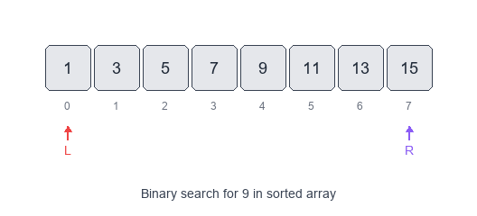
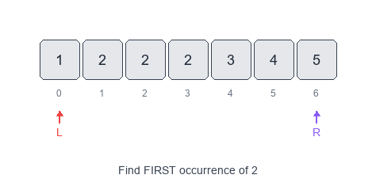
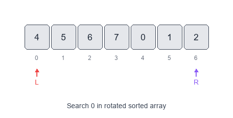

# Introduction to Modified Binary Search Pattern

Classic binary search assumes a **sorted** array and a simple "go left / go right" decision.

## Visual Examples

### Classic Binary Search


### Find First Occurrence


### Search in Rotated Array

The *Modified Binary Search* pattern keeps the same $O(\log n)$ search idea, but adapts it to handle more complex structure:
- rotated sorted arrays
- bitonic (increasing then decreasing) arrays
- duplicate values
- finding boundaries (first/last position)
- “next greater / ceiling / minimum difference” style queries

When to use
- The input is sorted *or almost sorted* (rotated, bitonic, with duplicates).
- You need **first/last occurrence**, **lower/upper bound**, or a **range**.
- The problem has a monotonic property where one side is always “valid” and the other “invalid”.

Common variants
- Order-agnostic binary search: works on ascending or descending arrays.
- Lower bound / upper bound:
  - first index with `arr[i] >= x`
  - first index with `arr[i] > x`
- Find first/last occurrence: derive from lower/upper bound.
- Rotated array search: one half is always sorted; decide which half contains the target.
- Rotation count / minimum element: find the pivot.
- Bitonic array:
  - find peak index
  - binary search in the increasing part, then the decreasing part
- “Infinite array” search: expand window exponentially, then binary search.

Pattern recipe

1) Identify the monotonic decision
- For each `mid`, decide which side *must* contain the answer.

2) Use correct bounds template
- For exact match: classic `while left <= right`.
- For boundary search (first/last): prefer `while left < right` and converge to an index.

3) Watch the off-by-one rules
- Boundary problems are typically won or lost by invariants.
  - Example invariant for lower bound: answer is always in `[left, right]`.

Complexity
- Time: $O(\log n)$ for most variants.
- Space: $O(1)$.

Short examples

Order-agnostic binary search — Python

```python
def order_agnostic_bs(arr, target):
    if not arr:
        return -1

    left, right = 0, len(arr) - 1
    is_asc = arr[left] <= arr[right]

    while left <= right:
        mid = (left + right) // 2
        if arr[mid] == target:
            return mid

        if is_asc:
            if target < arr[mid]:
                right = mid - 1
            else:
                left = mid + 1
        else:
            if target > arr[mid]:
                right = mid - 1
            else:
                left = mid + 1

    return -1
```

Lower bound (first index with `arr[i] >= x`) — Python

```python
def lower_bound(arr, x):
    left, right = 0, len(arr)  # right is exclusive
    while left < right:
        mid = (left + right) // 2
        if arr[mid] < x:
            left = mid + 1
        else:
            right = mid
    return left  # may be len(arr)
```

Find range (first and last occurrence) — Python

```python
def search_range(arr, target):
    left = lower_bound(arr, target)
    if left == len(arr) or arr[left] != target:
        return [-1, -1]

    right = lower_bound(arr, target + 1) - 1
    return [left, right]
```

Rotated array search (distinct values) — Python

```python
def search_rotated(arr, target):
    left, right = 0, len(arr) - 1

    while left <= right:
        mid = (left + right) // 2
        if arr[mid] == target:
            return mid

        # left half is sorted
        if arr[left] <= arr[mid]:
            if arr[left] <= target < arr[mid]:
                right = mid - 1
            else:
                left = mid + 1
        # right half is sorted
        else:
            if arr[mid] < target <= arr[right]:
                left = mid + 1
            else:
                right = mid - 1

    return -1
```

Problems to practice
- [Binary Search](https://leetcode.com/problems/binary-search/)
- [Find First and Last Position of Element in Sorted Array](https://leetcode.com/problems/find-first-and-last-position-of-element-in-sorted-array/)
- [Search in Rotated Sorted Array](https://leetcode.com/problems/search-in-rotated-sorted-array/)
- [Find Minimum in Rotated Sorted Array](https://leetcode.com/problems/find-minimum-in-rotated-sorted-array/)
- [Search in Rotated Sorted Array II](https://leetcode.com/problems/search-in-rotated-sorted-array-ii/) (duplicates)
- [Peak Index in a Mountain Array](https://leetcode.com/problems/peak-index-in-a-mountain-array/)
- [Search a 2D Matrix](https://leetcode.com/problems/search-a-2d-matrix/)
