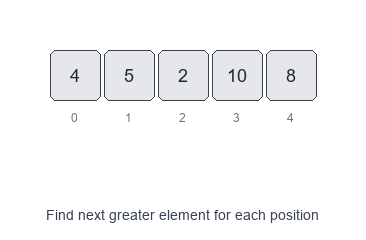
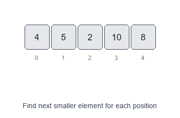

# Introduction to Monotonic Stack Pattern

A **monotonic stack** is a stack that keeps its elements in a **monotonic order** (either increasing or decreasing). As you scan an array, you pop elements that break the monotonic rule and use those pops to answer questions like:

## Visual Examples

### Next Greater Element


### Next Smaller Element


The monotonic stack helps find:
- the **next greater** element
- the **previous smaller** element
- the span/range where an element is the **minimum/maximum**

This turns many seemingly $O(n^2)$ nested-loop problems into clean $O(n)$ solutions.

When to use
- You need “next/previous greater/smaller” relationships.
- You need to compute spans or ranges (e.g., “how far until a larger value appears?”).
- You need to find, for every index, the nearest index to the left/right satisfying a comparison.
- You’re solving histogram/rectangle or subarray min/max contribution problems.

Common variants
- Monotonic **decreasing** stack (by value): great for **next greater**.
- Monotonic **increasing** stack (by value): great for **next smaller**.
- Stack of **indices** (most common): enables distances/spans and referencing original values.
- Circular array variant: iterate `2n` times using `i % n`.

Pattern recipe
1. Decide the comparison you need (greater vs smaller) and pick the monotonic direction.
2. Use a stack (usually of **indices**).
3. Scan left-to-right (typical for “next to the right”).
4. While the stack top breaks monotonicity with the current value:
   - pop an index `j`
   - resolve the answer for `j` using the current index `i`
5. Push the current index.
6. After the scan, any indices left in the stack have no valid “next” element (often answer remains `-1`).

Complexity
- Time: $O(n)$ — each index is pushed once and popped once.
- Space: $O(n)$ for the stack in the worst case.

Short examples

Next Greater Element (to the right) — Python

```python
def next_greater(nums):
    res = [-1] * len(nums)
    st = []  # indices, nums[st] is decreasing

    for i, x in enumerate(nums):
        while st and nums[st[-1]] < x:
            res[st.pop()] = x
        st.append(i)

    return res
```

Daily Temperatures (days until warmer) — Python

```python
def daily_temperatures(temps):
    res = [0] * len(temps)
    st = []  # indices, temps[st] is decreasing

    for i, t in enumerate(temps):
        while st and temps[st[-1]] < t:
            j = st.pop()
            res[j] = i - j
        st.append(i)

    return res
```

Previous Smaller Element (to the left) — Python

```python
def prev_smaller(nums):
    res = [-1] * len(nums)  # store index of previous smaller
    st = []  # indices, nums[st] is increasing

    for i, x in enumerate(nums):
        while st and nums[st[-1]] >= x:
            st.pop()
        res[i] = st[-1] if st else -1
        st.append(i)

    return res
```

Practical tips
- Use **indices** when you need distances (spans), boundaries, or to write results at positions.
- Be precise with strict vs non-strict comparisons:
  - For “next greater”, you usually pop while `<`.
  - For “next greater or equal”, pop while `<=`.
  - For “subarray minimum contributions”, tie-breaking (`<` vs `<=`) matters a lot.

Problems to practice
- [Next Greater Element I](https://leetcode.com/problems/next-greater-element-i/)
- [Daily Temperatures](https://leetcode.com/problems/daily-temperatures/)
- [Remove K Digits](https://leetcode.com/problems/remove-k-digits/)
- [Largest Rectangle in Histogram](https://leetcode.com/problems/largest-rectangle-in-histogram/)
- [Sum of Subarray Minimums](https://leetcode.com/problems/sum-of-subarray-minimums/)
