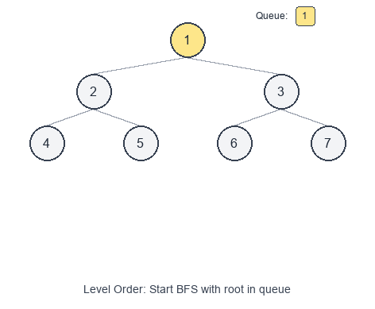

# Introduction to Tree Breadth First Search Pattern

**Tree Breadth First Search (Tree BFS)** traverses a tree **level by level**, exploring all nodes at depth 0, then depth 1, depth 2, and so on.

## Visual Example

### Level Order Traversal


It’s typically implemented with a **queue**:
- enqueue the root
- repeatedly dequeue a node and enqueue its children

This pattern is the backbone of “level order” style problems and is often simpler than DFS when the question is naturally about **levels**, **minimum depth**, or **closest** nodes.

When to use
- You need to process nodes **by level** (e.g., return values level-by-level).
- You need the **minimum** number of edges/levels to reach a target (BFS finds shortest paths in unweighted graphs/trees).
- You need to compute per-level aggregates (averages, sums, max).
- You need to connect nodes within the same level (next pointers).

Common variants
- Standard level order traversal: output nodes grouped by level.
- Reverse level order: bottom-up levels.
- Zigzag level order: alternate left-to-right and right-to-left.
- Per-level aggregation: min/max/sum/average per level.
- “First/last node of each level”: right/left view.

Pattern recipe
1. If the tree is empty, return an empty result.
2. Initialize a queue and add the root.
3. While the queue is not empty:
   - Record the current level size `level_size = len(queue)`.
   - Iterate `level_size` times:
     - pop a node from the queue
     - process it
     - push its children
   - finalize the level’s output (list, sum, max, etc.)

Complexity
- Time: $O(n)$ — every node is enqueued and dequeued once.
- Space: $O(w)$ — where $w$ is the maximum width of the tree (worst case $O(n)$).

Short examples

Binary Tree Level Order Traversal — Python

```python
from collections import deque

class TreeNode:
    def __init__(self, val=0, left=None, right=None):
        self.val = val
        self.left = left
        self.right = right


def level_order(root):
    if not root:
        return []

    result = []
    q = deque([root])

    while q:
        level_size = len(q)
        level = []

        for _ in range(level_size):
            node = q.popleft()
            level.append(node.val)

            if node.left:
                q.append(node.left)
            if node.right:
                q.append(node.right)

        result.append(level)

    return result
```

Minimum Depth of Binary Tree — Python

```python
from collections import deque

def min_depth(root):
    if not root:
        return 0

    q = deque([(root, 1)])

    while q:
        node, depth = q.popleft()

        if not node.left and not node.right:
            return depth

        if node.left:
            q.append((node.left, depth + 1))
        if node.right:
            q.append((node.right, depth + 1))

    return 0
```

Problems to practice
- [Binary Tree Level Order Traversal](https://leetcode.com/problems/binary-tree-level-order-traversal/)
- [Binary Tree Zigzag Level Order Traversal](https://leetcode.com/problems/binary-tree-zigzag-level-order-traversal/)
- [Binary Tree Right Side View](https://leetcode.com/problems/binary-tree-right-side-view/)
- [Minimum Depth of Binary Tree](https://leetcode.com/problems/minimum-depth-of-binary-tree/)
- [Populating Next Right Pointers in Each Node](https://leetcode.com/problems/populating-next-right-pointers-in-each-node/)
