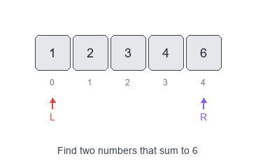
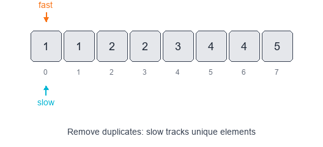

# Introduction to Two Pointers Pattern

The Two Pointers pattern uses a small number of indices (usually two) that move through a data structure to achieve linear-time solutions for many array/string problems.

## Visual Examples

### Opposite-Direction Pointers (Pair Sum)


### Same-Direction Pointers (Remove Duplicates)


When to use
- The input is ordered (or can be sorted) and you need to find pairs or windows.
- You need to partition, compare, or shrink/grow a window using indexes.

Common variants
- Opposite-direction pointers: one at the start and one at the end (useful for sums in sorted arrays).
- Same-direction pointers: both move forward to maintain a sliding window or partition.
- Fast & slow pointers: one moves faster (useful for cycle detection, middle element).

Pattern recipe
1. Sort the input if order matters (only when needed).
2. Initialize two pointers (`left`, `right`) at appropriate positions.
3. Move one pointer based on a comparison or condition; record results when satisfied.
4. Stop when pointers cross or the condition finishes.

Complexity
- Time: O(n) for a single pass (after optional sorting).
- Space: O(1) extra space (besides output storage).

Short examples

Pair with target sum (sorted array) — Python

```python
def two_sum_sorted(arr, target):
    left, right = 0, len(arr) - 1
    while left < right:
        s = arr[left] + arr[right]
        if s == target:
            return left, right
        if s < target:
            left += 1
        else:
            right -= 1
    return None
```

Squaring a sorted array — fill from end (Python)

```python
def sorted_squares(nums):
    n = len(nums)
    left, right = 0, n - 1
    result = [0] * n
    idx = n - 1
    while left <= right:
        if abs(nums[left]) > abs(nums[right]):
            result[idx] = nums[left] * nums[left]
            left += 1
        else:
            result[idx] = nums[right] * nums[right]
            right -= 1
        idx -= 1
    return result
```

Problems to practice
- [Pair with Target Sum](https://leetcode.com/problems/two-sum-ii-input-array-is-sorted/)
- [Squaring a Sorted Array](https://leetcode.com/problems/squares-of-a-sorted-array/)
- [Triplet Sum to Zero](https://leetcode.com/problems/3sum/) (combine two-pointers with loops)
- [Dutch National Flag Problem](https://leetcode.com/problems/sort-colors/)